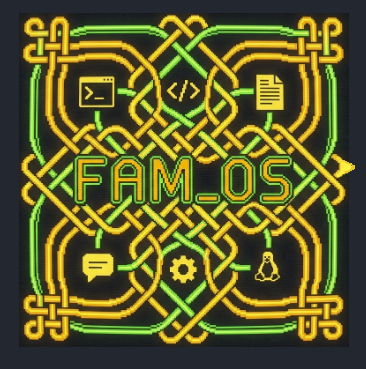

<p align="center">
  
</p>

<h1 align="center">FAM_OS</h1>
<h3 align="center">For All Mankind Operating System</h3>
<p align="center"><b>Local AI that actually runs on your Linux desktop — verified, resource-aware, and under your control.</b></p>
<p align="center">Built by <a href="https://www.linkedin.com/in/ivan-dimitrov-online/">Ivan Dimitrov</a></p>

---

FAM_OS is an always-on operating-system intelligence service built **above the Linux kernel**. It turns your existing applications, files, and tools into permissioned AI capabilities, then schedules models across your CPU, RAM, GPU/VRAM, and SSD with explicit budgets.

No cloud. No kernel replacement. No screen-clicking guessing game.

```text
Linux kernel
  -> FAM Supervisor          (minimal, deterministic, privileged)
  -> FAM Core                (unprivileged request lifecycle)
  -> Application Fabric       (existing apps as capabilities)
  -> Expert, Verification, Memory, and Hardware fabrics
```

A simple way to think about it: FAM_OS makes your whole PC itself intelligent, while keeping every action **scoped, approved, verified, and auditable**.


---

## Author

FAM_OS is being built by **[Ivan Dimitrov](https://www.linkedin.com/in/ivan-dimitrov-online/)**, an architect of intelligent systems based in Bulgaria.

---

## Why this matters

Today's AI assistants are usually one of the following:

- **Cloud chatbots** that cannot touch your local files, apps, or hardware.
- **IDE extensions** that understand code but not the rest of your desktop.
- **Screen-control agents** that click and type by watching pixels, with no real understanding of application state.
- **New AI-native operating systems** that want to replace the kernel and start from scratch.

FAM_OS takes a different path: **augment the Linux desktop you already have**. It turns existing programs into permissioned AI capabilities, verifies results before showing them to you, and schedules work across your CPU, RAM, GPU/VRAM, NPU, and SSD with explicit resource budgets.

---

## A simple, everyday example

You type into the FAM Shell:

> "Summarize the first five pages of the PDF in my Downloads folder and save a one-paragraph summary to my Desktop as `summary.txt`."

FAM_OS:

1. **Discovers** the Downloads and Desktop folders through scoped file capabilities.
2. **Extracts** the PDF text using a deterministic tool rather than guessing from a screenshot.
3. **Asks** you to confirm it can create `summary.txt` on the Desktop.
4. **Writes** the file only after you approve.
5. **Verifies** the file exists, is not empty, and matches the expected scope.
6. **Returns** the summary and records the action in the audit log.

---

## A concrete example

You type into the FAM Shell:

> "Refactor `stable_topological_sort` so it handles neighbor-only nodes and preserves input order, then run the tests and commit."

FAM_OS:

1. **Admits** your request to FAM Core with your current permission context.
2. **Observes** the active VS Code: editor through a native semantic connector and the test file through a scoped file adapter.
3. **Plans** a workspace edit, a test run, and a git commit.
4. **Asks** you to approve the edit and commit before executing — they are externally consequential.
5. **Executes** through the narrowest adapter: VS Code: connector, deterministic tool runner, and git.
6. **Verifies** postconditions: tests pass, file hash changed, working tree is clean.
7. **Returns** a verified result and writes an audit event.

If the VS Code: extension is not running, the same task degrades gracefully: FAM_OS reads the file directly, edits through the file adapter, runs tests, and tells you it used reduced-fidelity mode.

---

## Smallest verified model first

FAM_OS does not reach for the biggest model by default. Its router treats experts as a scheduled fabric:

1. **Estimate complexity.** A short traceback is routed to a small, fast code-explanation expert, for example `qwen3:1.7b`.
2. **Run the small expert.** It loads quickly and stays within a tight RAM/VRAM budget.
3. **Verify.** If the explanation passes the verifier — correct schema, no invented file paths, consistent with the traceback — it is released immediately.
4. **Escalate only if needed.** If the small expert fails verification, the router evicts it, checks the current `full-reference-workstation` profile, and tries a stronger model such as `qwen2.5-coder:14b` within the remaining GPU/VRAM budget.
5. **Degrade safely.** If the stronger model also fails, FAM_OS returns a deterministic traceback parse and a structured failure instead of a guessed answer. If the GPU is already full, it falls back to the `compat-cpu-16gb` profile. If nothing can satisfy the task, it declines and records the reason in the audit log.

This is the opposite of both "always call the biggest model" and "always call the smallest model": FAM_OS picks the smallest model that can be *verified* for the task, and every fallback is explicit.

---

## Context windows are memory, not a model spec

Most AI tools treat "context window" as a fixed number on a model card. FAM_OS treats context as a **scheduled memory allocation**:

- It reads the machine's actual **cgroup limits** instead of trusting the memory number reported by an inference engine.
- It budgets prompt tokens, KV cache, model weights, and working set across **RAM, GPU/VRAM, and SSD-backed cache**.
- It can page a small expert out and load a larger one only when verification evidence justifies the cost, but it never silently counts SSD capacity as RAM.
- A stronger host exposes its full CPU, RAM, accelerator memory, and storage tiers to the scheduler with explicit OS headroom, so a 1.7B model can answer a quick question, be evicted, and then a 26B model can be loaded for a harder one — without everything resident at once or crashing into swap.

In short: FAM_OS schedules intelligence like an operating system schedules processes, because that is exactly what it is.

---

## NPU as a first-class accelerator

FAM_OS treats NPUs as optional acceleration tiers, not afterthoughts. On an Intel Arrow Lake NPU it has already run a deterministic intent-routing micro-expert through an OpenVINO container with device pass-through.

Result:

- `execution_devices: ["NPU"]` — no CPU fallback.
- Expected class `code`, observed class `code`.
- Confidence: 99.7%.
- Compile time: ~52 ms.
- First inference: ~8 ms.
- Warm inferences: ~0.5–0.8 ms each.
- `fallback_used: false`.

This is a proof that a tiny router expert can run on an NPU inside a controlled container and return a verifiable result. Production NPU admission, scheduling, and quality gates remain later Expert Fabric work.

---

## The landscape — what else exists?

FAM_OS overlaps with several active areas. None of the projects below is a direct equivalent, but they cover pieces of the same space.

| Category | Example projects | What they do | How FAM_OS differs |
|---|---|---|---|
| **AI-native / cognitive OS** | [Aegis-Core](https://github.com/Gustavo324234/Aegis-Core), [XKernel](https://github.com/JosephBerm/XKernel) | Treat agents as first-class kernel/cognitive processes with scheduling, memory, and capability security. | FAM_OS **does not replace Linux or the kernel**. It adds a minimal deterministic supervisor and an unprivileged Core on top, so it can run on a normal desktop today. |
| **Desktop computer-use agents** | [Open Computer Use](https://chatgate.ai/post/open-computer-use), [Cua](https://cua.ai/), [Open Interpreter](https://github.com/openinterpreter/openinterpreter/), [computer-agent](https://github.com/suitedaces/computer-agent) | Drive the desktop by screenshots, accessibility trees, cursor, and keyboard. | FAM_OS treats screen/input as the **last rung of a ladder**, not the default. It prefers native semantic connectors and deterministic OS/tool adapters, and it verifies results rather than trusting vision-only actions. |
| **Coding agents / IDE assistants** | [Cline](https://github.com/Cline/Cline), Claude Code, Cursor, GitHub Copilot | Assist inside the editor with code generation, commands, and MCP tools. | FAM_OS is **OS-level**, not editor-level. It can coordinate VS Code:, a terminal, a browser, a file manager, and a test runner into one verified cross-application task. |
| **AI agent workspaces** | [Wegent](https://github.com/wecode-ai/Wegent), Dify, Flowise | Self-hostable chat/knowledge/automation workspaces with connectors. | Workspaces are usually chat-first or workflow-first. FAM_OS is a local **service fabric** woven into the Linux desktop, with explicit hardware scheduling, verification, audit, and application adapters. |
| **Agent security & capability layers** | [agent-kernel](https://github.com/dgenio/agent-kernel), AgentFence, contextweaver, [Cord](https://github.com/fosenai/cord) | Provide capability tokens, policy enforcement, audit traces, context selection, or decentralized capability discovery. | FAM_OS includes similar safety concerns but wraps them in a complete runtime: Linux hardware discovery, cgroup scheduling, verified execution, application weaving, local memory, and a terminal Shell. |
| **MCP tooling** | [mcp-cli / mcps](https://github.com/iTzFaisal/mcp-cli) | Discover, install, and manage MCP servers across agents. | MCP is **one replaceable adapter** in FAM_OS, not the product. The internal Application Fabric contracts are protocol-agnostic. |
| **Local inference stacks** | Ollama, vLLM, llama.cpp | Serve open models locally. | FAM_OS orchestrates intelligence *above* them; it does not replace them. |

*Comparisons are based on publicly available documentation and source code. They are intended to clarify positioning, not to claim feature parity or superiority in every dimension.*

---

## What makes FAM_OS different

The combination below is the project's core bet:

| Principle | Why it matters |
|---|---|
| **Above Linux, not replacing it** | Uses the real kernel, cgroups, namespaces, and systemd. No new microkernel required. |
| **Deterministic supervisor + unprivileged Core** | Models never run inside the privileged supervisor or kernel. |
| **Verification-first** | Every result or action must satisfy a declared acceptance policy before it is released to you. |
| **Observation ≠ action** | Seeing an app does not grant permission to change it. |
| **Application weaving ladder** | Native semantic → OS/tool → accessibility → screen, degrading gracefully rather than defaulting to screenshots. |
| **Resource-aware scheduling** | CPU/RAM/GPU-VRAM/**NPU**/SSD budgets with a constrained `compat-cpu-16gb` baseline and a `full-reference-workstation` profile. |
| **MCP as an adapter** | Not locked into one connector protocol. |
| **Local-first and privacy-reviewed** | Workstation captures scrub identifiers and retain failed baselines as evidence. |
| **Audit + approval as first-class** | Every action carries scope, reversibility, confirmation policy, and an audit event. |

---

## Current status

FAM_OS is a working prototype, not a packaged product.

- **Phases 1–15 are complete.** This includes the FAM Shell terminal UI, the Application Fabric, MCP client/server adapters, Linux accessibility and discovery bridges, deterministic tool adapters, action safety, a real cross-application acceptance demo, the Expert Fabric manifest schema, the Hardware Scheduler with cgroup-aware resource observation and GPU/VRAM/NPU/SSD budgeting, the Verification Fabric with verifier manifests and hardened sandboxing, the multi-task Expert Fabric, permissioned memory and retrieval, local adaptation, trusted multi-device fabric, expert factory, and full productization with install/update/diagnose/repair/remove support.
- **Installed operational acceptance passed.** A fresh isolated installation starts `fam-service`, answers a real `qwen3:1.7b` request through Ollama, serves the authenticated Console, repairs damage, and removes every installed artifact cleanly.

### Evidence snapshot

These numbers come from local runs on the `full-reference-workstation` profile. Absolute paths, usernames, hostnames, and raw model outputs have been removed.

| Milestone | Result |
|---|---|
| Unit + contract test suite | **842 passed** (2 environment-dependent skips) |
| Cross-application acceptance demo (Phase 5.12) | **Passed**: accessibility 2/2, MCP 1/1, OS/tool 5/5, native semantic 4/4 |
| Strong-model quality rerun (Phase 2.14) | `laguna-xs.2:q4_K_M` **passed after one repair**; `gemma4:26b` **passed on first attempt** |
| Original 7B/14B smoke baseline | **Preserved as failed baseline** for comparison; verification requirements were not weakened |
| Hardware scheduler (Phase 7) | cgroup-aware observation, GPU/VRAM split-offload, SSD-backed model paging, NPU feasibility, cache telemetry, and bounded predictive prefetching |
| Verification Fabric (Phase 8) | Verifier manifests, hardened sandbox, and quality gates for Python, JS/TS, Rust, math, retrieval, and application actions |
| Multi-task Expert Fabric (Phase 9) | Five-family benchmark, micro-experts, verified code escalation, retrieval tiers, verified math, local media, efficiency reports, and expert evolution |
| Memory + retrieval fabric (Phase 10) | Permissioned document indexes, encrypted chunks, scope-first relevance, inspection/export/deletion, 100% live top-1 retrieval |
| Local adaptation (Phase 11) | Repeated-workflow latency improvement (1.0 s → 0.13 s), verified-outcome prediction, preference adapters, operating-state policy, drift rollback |
| Trusted multi-device fabric (Phase 12) | Encrypted authenticated desktop/laptop/home-server demo with remote expert selection and disconnect recovery |
| Expert Factory (Phase 13) | End-to-end train, package, sign, publish, regression-gate, and retire lifecycle |
| Reliability + security (Phase 14) | Threat models, atomic update/rollback, multi-user isolation, recovery mode, long-running soak/crash tests, reproducible benchmarks |
| Productization / install (Phase 15) | Isolated prefix install, systemd unit verification, real Shell request through Ollama, authenticated Console, diagnose/repair/remove |
| Resource discipline | **Zero swap**, **zero OOM kills**; CPU/RAM/VRAM/NPU/SSD measured per run |

Full architecture records, implementation handoffs, and decision records are kept inside the repository under `docs/` and `handoffs/`.

### Why Phases 7 and 8 matter

**Phase 7 turned model loading from a free-for-all into a scheduled resource decision.** FAM_OS now reads actual cgroup limits, admits or evicts experts, splits loads between CPU and GPU/VRAM, pages weights to and from SSD-backed storage, probes the NPU as a real inference target, and uses cache telemetry plus bounded prefetching so a small expert can answer quickly and a large expert can be loaded only when verification evidence justifies the cost. A 16 GiB machine stays alive; a full-workstation machine exposes all of its tiers without artificial ceilings.

**Phase 8 turned output trust from "the model said so" into "the verifier confirmed it."** Every result must pass declared acceptance gates before it reaches you: Python syntax, unit tests, Mypy, and Ruff; JavaScript/TypeScript and Rust compiler/tests; symbolic and numerical math checks; retrieval citation and provenance; and application-action pre/postconditions. If a verifier fails, a sandbox cannot isolate, or a repair/escalation budget is exhausted, the result is withheld — not laundered through a bigger model.

Together they make the "smallest verified model first" strategy real: you can safely use a 1.7B expert because mistakes are caught, and you can run a 26B expert because the scheduler makes room without crashing.

---

## Roadmap

- **[x] Phase 7 — Hardware scheduler and neural pager:** Turn context length and model residency into scheduled memory allocations across CPU, RAM, GPU/VRAM, NPU, and SSD cache.
- **[x] Phase 8 — Verification Fabric:** Plug-in verifier packages, deterministic sandbox policy, and stronger postcondition checking.
- **[x] Phase 9 — Multi-task Expert Fabric:** Smaller, swappable experts coordinated by a router instead of one giant model per request.
- **[x] Phase 10 — Memory and retrieval fabric:** Permissioned short-term and long-term memory with provenance and retrieval.
- **[x] Phase 11 — Local adaptation and predictive behavior:** Learn from your workflows without baking personal data into model weights.
- **[x] Phase 12 — Trusted multi-device fabric:** Extend the same supervised boundary to trusted local devices.
- **[x] Phase 13 — Expert Factory and hardware-aware training:** Tools to build, verify, and optimize experts for the target machine.
- **[x] Phase 14 — Reliability, security, and productization:** Make FAM_OS trivial to install, update, diagnose, repair, and completely remove on Linux; harden the runtime; and publish reproducible benchmarks.
- **[x] Phase 15 — Installed operational acceptance:** Prove FAM_OS works as an installed, startable local AI product answering real requests through Ollama.

The core roadmap is complete. The remaining item is a third-party human penetration test, which is explicitly not represented as certification.

---

## Get involved

1. Read the architecture overview: `docs/architecture/APPLICATION_WEAVING.md`
2. Read the MCP boundary: `docs/architecture/MCP_APPLICATION_CONNECTOR.md`
3. Run the tests: `PYTHONPATH=src:. python3 -m unittest discover -s tests`

## License

MIT — see `LICENSE`.
