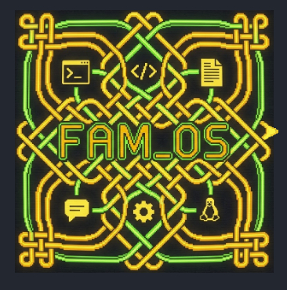
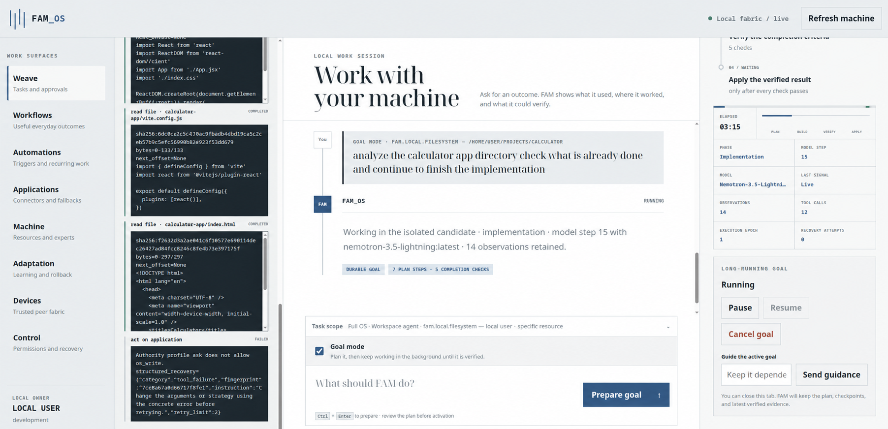

<p align="center"></p>
<h1 align="center">FAM_OS</h1>
<h3 align="center">For All Mankind Operating System</h3>
<p align="center"><b>A local-first AI agent that can understand a workspace, use Linux tools, edit real projects, and keep working until the result is verified.</b></p>
<p align="center">Built by <a href="https://www.linkedin.com/in/ivan-dimitrov-online/">Ivan Dimitrov</a></p>

---

FAM_OS is an agent runtime built above Linux. It gives local models a persistent conversation, a bounded set of real tools, durable long-running goals, isolated engineering workspaces, and evidence-based verification.

It is designed to feel closer to Codex, Claude Code, or Windsurf than to a one-shot chatbot, while keeping inference and execution on the owner's machine.

```text
User objective
  -> adaptive agent harness
  -> relevant tools and compact working context
  -> observe / edit / execute / recover
  -> verify declared completion criteria
  -> apply the accepted candidate to the selected workspace
```

FAM_OS does not replace the Linux kernel and does not require every selected folder to be a Git repository. Ordinary filesystem tasks use direct, task-scaled operations. Repository engineering uses Git only when repository semantics are actually needed.

<p align="center">
  
</p>
<p align="center"><i>Goal Mode working through a local engineering task with live tool evidence, candidate isolation, progress telemetry, and recovery controls.</i></p>

## What works today

- **Conversational workspace assistance.** Follow-up requests retain the objective, recent decisions, relevant observations, changed files, and unresolved errors instead of treating every prompt as a new conversation.
- **Adaptive local tool use.** The model starts with the smallest relevant tool set and can request more capabilities as the task develops.
- **Real filesystem and command execution.** The agent can inspect folders, read and write files, create directories, run project commands, and verify their effects.
- **Stateful application testing.** An Application test profile can launch or attach to localhost web apps, interact through structured Playwright snapshots, retain console/network evidence, assert outcomes, and capture screenshots, traces, and videos.
- **Task-scaled execution.** A simple file operation does not enter a heavyweight repository workflow. Larger engineering work receives planning, mutation, and verification phases.
- **Isolated candidate workspaces.** Engineering changes are built away from the owner's folder. The Console shows created, modified, and deleted paths while the goal runs; verified work is reconciled into the real workspace at the end.
- **Durable Goal Mode.** A reviewed plan can continue in the background across many model/tool steps. Goals support pause, resume, guidance, cancellation, checkpoints, elapsed time, progress signals, and completion criteria.
- **Automatic recovery.** Transient model disconnections, timeouts, unloading, and stalled requests enter `retry_wait`, run provider health/recovery checks, and resume from the same durable checkpoint and candidate workspace. Confirmed filesystem effects are not blindly repeated.
- **Compact evidence.** Tool output is summarized and bounded before it returns to a local model; retained observations are compacted around the objective and current work.
- **Local model routing.** General and engineering work can use different Ollama models. The current workstation configuration has been exercised with `qwen3.8:27b` for engineering work.
- **Authenticated local Console.** The browser UI exposes workspace selection, conversation, tool evidence, candidate changes, Goal Mode controls, recovery state, and machine status.

## How the agent loop works

For an ordinary request, FAM_OS selects a task-sized path:

1. Preserve the conversation objective and select the relevant workspace context.
2. Expose only the tools likely to help with the current step.
3. Let the model observe, reason, and call tools iteratively.
4. Return small semantic results such as `exists=true`, the resulting path, changed hashes, or command status.
5. Repair malformed calls or recover from transient failures without discarding useful progress.
6. Verify the requested outcome and report what actually happened.

For Goal Mode, the lifecycle is longer:

1. **Prepare:** create a plan and explicit completion checks for owner review.
2. **Build:** copy the selected workspace into an isolated candidate and let the agent work there.
3. **Verify:** evaluate every completion criterion against the candidate using real file and command evidence.
4. **Apply:** reconcile the verified candidate into the owner's workspace, then check the applied result.

The original folder remains unchanged while Build and Verify are running. If a goal pauses, the service restarts, or the model temporarily disappears, the durable goal record and candidate are preserved.

## Run the current development service

### Prerequisites

- Linux with Python 3.12 or newer
- an existing development environment at `.verification-venv`
- Ollama listening locally (the command below expects port `11435`)
- the configured model already pulled into Ollama

From the repository root, choose state and runtime locations using the standard
XDG directories:

```bash
export FAM_STATE_ROOT="${XDG_DATA_HOME:-$HOME/.local/share}/fam-os"
export FAM_RUNTIME_ROOT="${XDG_RUNTIME_DIR:-/run/user/$(id -u)}/fam-os-adaptive-agent"

PYTHONPATH=src .verification-venv/bin/python -m fam_os.product.service \
  --state-root "$FAM_STATE_ROOT" \
  --runtime-root "$FAM_RUNTIME_ROOT" \
  --model qwen3.8:27b \
  --engineering-model qwen3.8:27b \
  --ollama-url http://127.0.0.1:11435 \
  --external-ollama \
  --console-port 8775
```

Keep that process running. In a second terminal, verify both services:

```bash
ss -ltnp | rg ':8775|:11435'
curl -sS -o /dev/null -w '%{http_code}\n' http://127.0.0.1:8775/
```

Open a fresh authenticated Console session from another terminal:

```bash
PYTHONPATH=src .verification-venv/bin/python -c \
  'import os; from pathlib import Path; from fam_os.product.console_cli import run_console_command; raise SystemExit(run_console_command(Path(os.environ["FAM_RUNTIME_ROOT"]), 8775))'
```

The launcher opens a tokenized local URL. A bookmarked Console URL can expire; run the launcher again instead of reusing an old token.

> Installed builds use the `fam-service`, `fam-os`, and `fam-console` entry
> points declared in `pyproject.toml`.

## Try it

Choose a workspace with **Open folder**, select **Use folder**, and start with bounded tasks:

```text
Explain this project and identify its real test and build commands.
```

```text
Inside reports, create alpha.txt, beta.txt, and gamma.txt containing
ALPHA, BETA, and GAMMA respectively. Verify all three files.
```

Then test conversation continuity:

```text
Create a concrete improvement plan for this project.
```

```text
Implement the plan, run the relevant tests, and summarize the changed files.
```

For a larger task, enable **Goal mode**, submit an outcome such as:

```text
Plan and fully implement a browser-based Snake game in this folder.
Verify that it builds, that its tests pass, and that the game can be started.
```

Review the proposed plan and completion criteria before activation. While it runs, use the Candidate view to inspect the isolated file tree and the activity panel to monitor phase, elapsed time, model step, observations, execution epochs, recovery attempts, and last signal.

## Model configuration

| Argument | Purpose |
|---|---|
| `--model` | Default local model for ordinary requests and general reasoning. |
| `--engineering-model` | Preferred model for iterative workspace engineering and Goal Mode. When omitted, FAM_OS selects the strongest recognized installed coding model and falls back to `--model`. |

`qwen3.8:27b` is the currently exercised engineering configuration in this checkout. Smaller quantized models remain useful for focused reading, classification, and small edits, but reliable autonomous engineering depends heavily on tool-calling quality, context capacity, and available RAM/VRAM.

FAM_OS does not reload model weights for every prompt when Ollama keeps the model resident. A cold or evicted model can still make the first response slow. Residency, model size, concurrent workloads, and Ollama keep-alive settings determine that latency.

## Candidate workspaces and trust

During engineering work, file mutations and commands shown in the Tool Terminal may target an isolated candidate under the FAM_OS state directory rather than the selected owner folder. This is intentional:

- **Build:** changes appear in Candidate view but not yet in the owner's file manager.
- **Verify:** tests and completion checks run against that same candidate.
- **Apply:** only a verified candidate is reconciled into the owner workspace.
- **Failure or cancellation:** candidate evidence is preserved for inspection; the owner workspace remains unchanged.

Commands execute with the selected agent-access profile. Approval and isolation are product boundaries, but they should not prevent ordinary, authorized filesystem work or force non-repository folders into Git workflows.

## Architecture

```text
Linux
  -> FAM Supervisor             resource and execution boundary
  -> FAM Core                   request, permission, and outcome lifecycle
  -> Adaptive Agent Harness     context, tools, recovery, and iteration
  -> Application Fabric         filesystem, commands, Git, apps, MCP
  -> Expert Fabric              local model selection and residency
  -> Verification Fabric        semantic and command postconditions
  -> Memory / Goal Store        conversation and durable checkpoints
  -> Authenticated Console      control, evidence, and candidate visibility
```

Useful implementation guides:

- [Adaptive agent harness](docs/operations/ADAPTIVE_AGENT_HARNESS.md)
- [Workspace tool loop](docs/operations/WORKSPACE_TOOL_LOOP.md)
- [Application test harness](docs/operations/APPLICATION_TEST_HARNESS.md)
- [Shell and Console](docs/operations/FAM_SHELL_AND_CONSOLE.md)
- [Installed operation](docs/operations/INSTALLED_OPERATION.md)
- [Application weaving](docs/architecture/APPLICATION_WEAVING.md)
- [Safe service recovery](docs/architecture/SAFE_SERVICE_RECOVERY.md)

Architecture decisions and implementation handoffs are retained under `docs/decisions/` and `handoffs/`. They are engineering history, not a substitute for this current operator guide.

## Development and verification

Run the complete test suite:

```bash
PYTHONPATH=src:. .verification-venv/bin/python -m unittest discover -s tests
```

For faster navigation, this repository maintains a Larry code map:

```bash
larry search "where is durable Goal Mode implemented?"
larry find GoalModeService
```

The active implementation lives entirely under `FAM_OS/`. The sibling RNF prototype and its historical artifacts are read-only evidence and are not runtime dependencies.

## Project status

FAM_OS is an active Linux prototype, not yet a packaged consumer product. Its broad fabrics and installed lifecycle exist, but autonomous quality still depends on the selected local model, hardware, project toolchain, and completion checks. A successful UI step is not treated as proof by itself: trustworthy completion requires file, command, or semantic evidence from the requested workspace.

## License

MIT — see [LICENSE](LICENSE).
